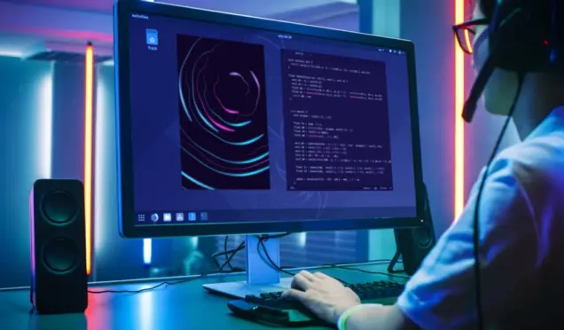

## shader-view

Almost all shader editors comes with their own, not always good IDE. But what if you are, 
similar to me want to stick with your favorite code editor.  This standalone shader-viewer 
allows you to preview 2D shaders, hot-reload them and save animations. It is intendend for 
those who don't use any engines, therefore it doesn't provide 3D shapes for BSDF debugging, 
just single viewplane for generative textures. I'm not interested in game making, my primarily 
target it's a motion design for POS.

## compilation

> premake5 gmake2 --
> cd build --
> make config=release --
> cd --

## usage

In order to compile this thing, you need standard SDL2, glew, opengl. Currently only
Windows supported, but it's easy to change system specific code, there is very small
amount of it. To run with mouse and keybord input type ...

> shader-view -i -x 400,600 -f test.frag 

To record animation ...

> shader-view -a 48 -x 400,600 -f test.frag -o anim/frame_name

|option|meaning  |
|--|--|
|-h |help  |
|-a N|record N frames|
|-x W,H|size of the window|
|-f file|fragment shader|
|-o file|animation output|

Keyboard bindings
|key|function|
|--|--|
|a|absolute value|
|i|1 - value|
|r|red channel|
|g|g channel|
|b|b channel|
|c|color picker|
|t|toggle timer|

Press right mouse button to show information about pixel, this information also 
copied to clipboard as a color vec4(R, G, B, 1.0).

## time
Notice, when recording animation with -a, timer inerpolates from 0 to 1, therefore you
should remap it to desired range in your fragment shader.  
